# Pom Visualizer Maven Plugin

## Intro

Maven [POMs](https://maven.apache.org/pom.html) are verbose and their plugin executions are not linearly ordered. 
This can make parsing large, complex Maven builds tricky.

This plugin hooks into the Maven lifecycle, orders the execution of the various plugins and visualizes their execution with respect to their lifecycle phase.

The output is a small website that visualizes the Maven pom using [Mermaid-Js](https://mermaid-js.github.io/mermaid/#/) and an associated markdown file you can embed in your [Github README](https://github.blog/2022-02-14-include-diagrams-markdown-files-mermaid/).

## Sample Output

The POM Visualization for this plugin's default lifecycle:

```mermaid
  flowchart TB 
subgraph defaultWrapper["default Lifecycle..."]
 direction TB 
subgraph process-resources["process-resources"]
 direction TB 
node1{{"maven-resources-plugin:default-resources"}}
style node1 fill:white,stroke:blue,color:black
end 
process-resources-->compile
style process-resources fill:white,stroke:red,color:#d14
subgraph compile["compile"]
 direction TB 
node2{{"maven-compiler-plugin:default-compile"}}
style node2 fill:white,stroke:blue,color:black
end 
compile-->process-classes
style compile fill:white,stroke:red,color:#d14
subgraph process-classes["process-classes"]
 direction TB 
node3{{"maven-plugin-plugin:default-descriptor"}}
style node3 fill:white,stroke:blue,color:black
end 
process-classes-->process-test-resources
style process-classes fill:white,stroke:red,color:#d14
subgraph process-test-resources["process-test-resources"]
 direction TB 
node4{{"maven-resources-plugin:default-testResources"}}
style node4 fill:white,stroke:blue,color:black
end 
process-test-resources-->test-compile
style process-test-resources fill:white,stroke:red,color:#d14
subgraph test-compile["test-compile"]
 direction TB 
node5{{"maven-compiler-plugin:default-testCompile"}}
style node5 fill:white,stroke:blue,color:black
end 
test-compile-->test
style test-compile fill:white,stroke:red,color:#d14
subgraph test["test"]
 direction TB 
node6{{"maven-surefire-plugin:default-test"}}
style node6 fill:white,stroke:blue,color:black
end 
test-->package
style test fill:white,stroke:red,color:#d14
subgraph package["package"]
 direction TB 
node7{{"maven-plugin-plugin:default-addPluginArtifactMetadata"}}
node7-->node8
style node7 fill:white,stroke:blue,color:black
node8{{"maven-jar-plugin:default-jar"}}
style node8 fill:white,stroke:blue,color:black
end 
package-->install
style package fill:white,stroke:red,color:#d14
subgraph install["install"]
 direction TB 
node9{{"maven-install-plugin:default-install"}}
style node9 fill:white,stroke:blue,color:black
end 
install-->deploy
style install fill:white,stroke:red,color:#d14
subgraph deploy["deploy"]
 direction TB 
node10{{"nexus-staging-maven-plugin:injected-nexus-deploy"}}
style node10 fill:white,stroke:blue,color:black
end 
style deploy fill:white,stroke:red,color:#d14
end 
style defaultWrapper fill:white,stroke:black,color:black
linkStyle default fill:none,stroke:#333333
```


The HTML version adds interactivity to the graph nodes.

## Usage

This plugin has a single goal and is relatively light on configuration.

Typically, you will want to execute this as a standalone plugin:

```
    mvn io.github.floverfelt:pom-visualizer-maven-plugin:1.0.0:visualize
```

This will generate the visualization in your build's target directory and then open the visualization in your browser of choice.

If you'd like to add the plugin as a part of your build lifecycle, this is a sample with all the plugin's configuration specified:

```xml
<plugin>
    <groupId>io.github.floverfelt</groupId>
    <artifactId>pom-visualizer-maven-plugin</artifactId>
    <version>1.0.0</version>
    <executions>
        <execution>
            <id>visualize-pom</id>
            <!-- The phase binding only affects when the plugin executes, not the output -->
            <phase>compile</phase>
            <goals>
                <!-- This is the plugin's only goal -->
                <goal>visualize</goal>
            </goals>
            <configuration>
                <!-- Whether to skip the execution, default: false -->
                <skip>false</skip>
                <!-- Whether to open the visualization in a web browser after generation, default: true -->
                <openAfterExecution>true</openAfterExecution>
                <!-- Whether to skip visualizing phases which have no plugins bound to them -->
                <skipEmptyPhases>true</skipEmptyPhases>
            </configuration>
        </execution>
    </executions>
</plugin>
```

## Other Documentation

This plugin is bound to no lifecycle phase by default.

Since it hooks directly into your POMs execution the pom-visualizer-maven-plugin **is** profile sensitive. 
This means that if you execute it with different profiles it **will** produce different output.
Likewise, it will inherit plugin executions from parent poms.

The output markdown and associated HTML/JS files are stored in your build's output directory in a folder labeled pom-visualizer-maven-plugin

If executed in a multi-module POM, it will produce a visualization for each sub-project. 
**WARNING**: This can result in a large number of browser tabs being opened if you don't specify the openAfterExecution flag.

## Contribution

Pull requests are welcome and feel free to report issues [here](https://github.com/floverfelt/pom-visualizer-maven-plugin/issues).

If you'd like to support the plugin monetarily, you can do so [here](https://www.buymeacoffee.com/floverfelt).